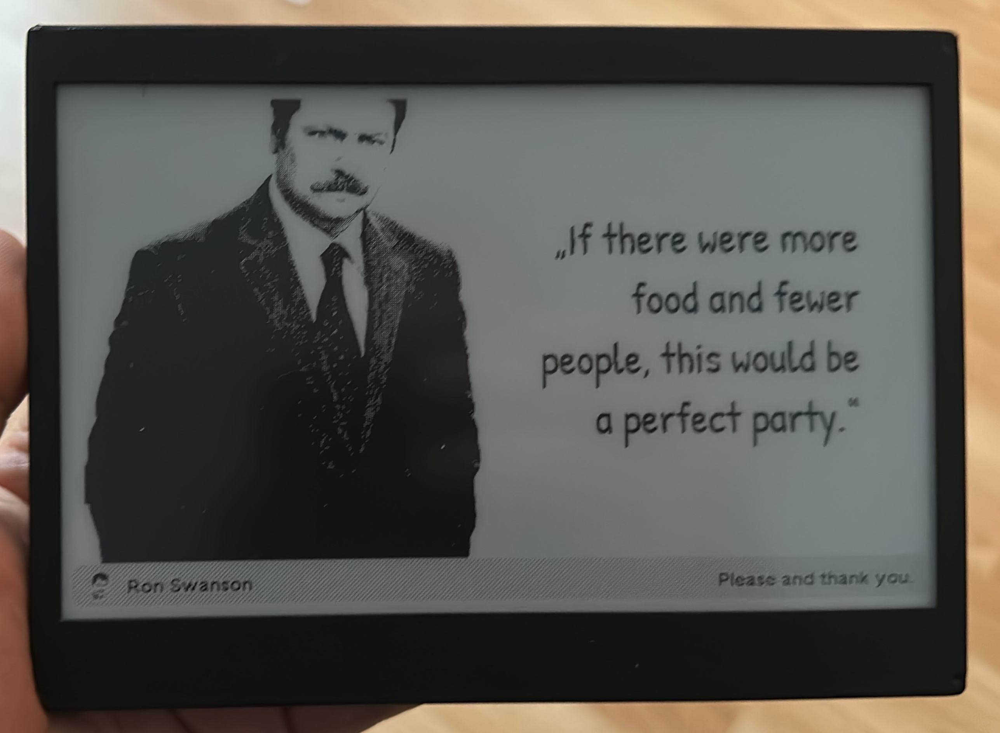

# Makeshift Trmnl

# BOM
- [Display and Controller](https://www.amazon.de/Waveshare-Electronic-Interface-Bluetooth-Raspberry/dp/B07MB7SVHQ)
> DISCLAIMER! This Microcontroller is not compatible with the original Firmware. However you can use a modified version of @jessereockz ESPHome Implementation on [Github](https://github.com/jesserockz/esphome-trmnl/)
- [Battery](https://www.amazon.de/dp/B08FDP59WD)
- [JST Connectors](https://www.amazon.de/dp/B07VYR7J49)
- [Screws M2x6](https://www.amazon.de/dp/B0CQ264DRG)
- [Insets](https://www.amazon.de/dp/B0CNKH7N16)

## Optional (On/Off Toggle + Button)
- [Switches](https://www.amazon.de/dp/B09TVFF6KW)
- [Microswitch](https://www.amazon.de/gp/product/B088LZD9RX)
- [100k Ohm Resistor](https://www.amazon.de/Innfeeltech-Toleranz-Widerstand-Projekt-Experimente/dp/B0CL6LTDZ5)
- [10k Ohm Resistor](https://www.amazon.de/Innfeeltech-Toleranz-Widerstand-Projekt-Experimente/dp/B0CL6NGWQY)
- [Blanko PCB](https://www.amazon.de/dp/B078HV79XX)

Not mandatory but good for a clean look
- [Shrink Tubing](https://www.amazon.de/Pointool-St%C3%BCck-Schrumpfschlauch-Schrumpfschl%C3%A4uche-Automobilverkabelung/dp/B08N5246YB)
- [Silicone Wiring](https://www.amazon.de/Fermerry-Litzendraht-Kupferdrahtspule-Elektrokabel-Kit-Anschlusskabelsatz/dp/B089CSCY8S)

## Tools
- [Soldering Iron](https://eleshop.de/pinecil-smart-mini-tragbarer-lotkolben.html)
- [Crimp Tool](https://www.amazon.de/Crimpzange-Preciva-JST-XH-Kontakte-JST-XH-Stifte-Pin-Stecker-Kits/dp/B0CH37171Q)
- Solder
# Acknowledgement
- Many thanks to the [Trmnl Team](https://usetrmnl.com) for this nice pice of Equipment
- @jesserocks for the incredible work on the ESPHome alternative Firmware [Github](https://github.com/jesserockz/esphome-trmnl/))
- @sn0opy for the base case STL-Files [Github](https://github.com/sn0opy/openscad-screen-case)

# Todo
Upload the final ESPHome yaml after the debugging is done :)